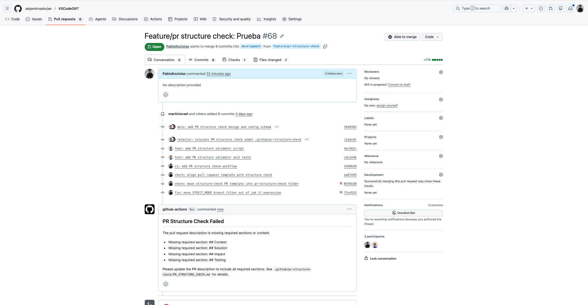
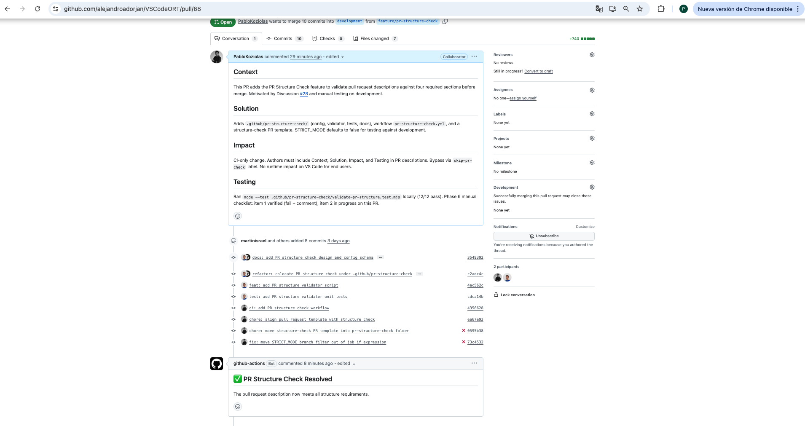
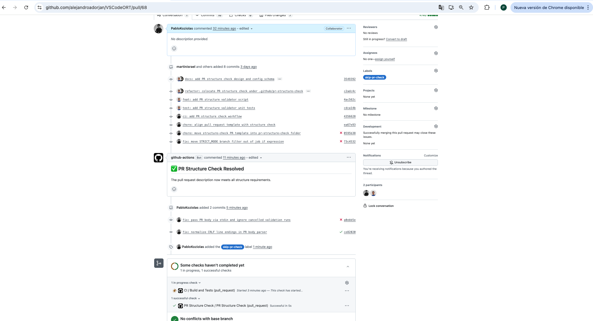
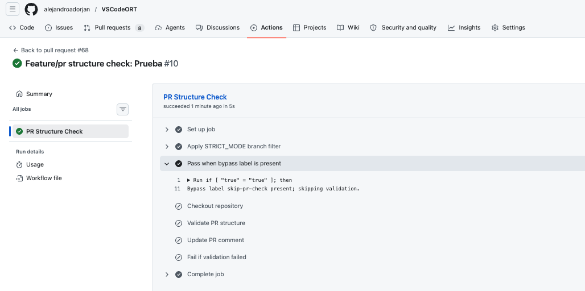
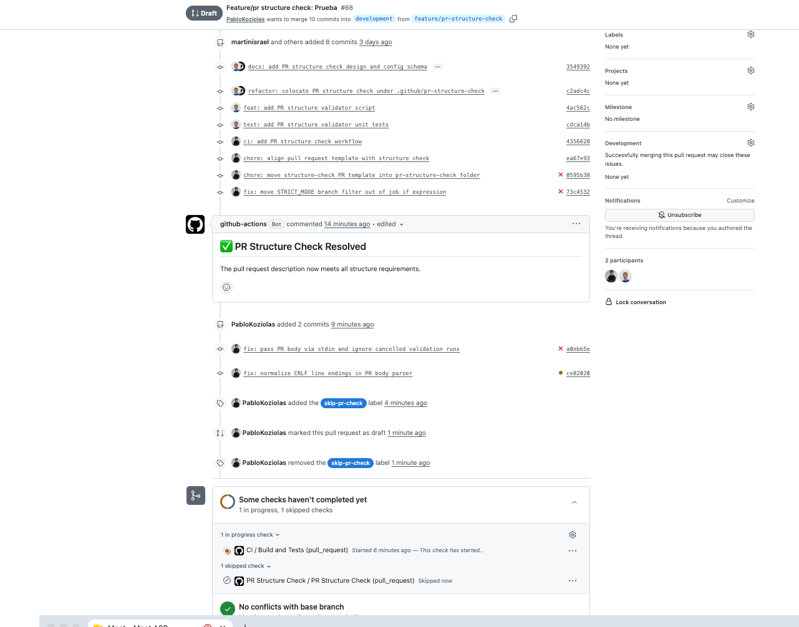

# PR Structure Check — evidencia manual

PR de prueba: [#68](https://github.com/alejandroadorjan/VSCodeORT/pull/68) (`feature/pr-structure-check` → `development`).

Capturas en [`images/`](./images/).

## 1. Body vacío → falla

## 2. Secciones completas → pasa

## 3. Bypass `skip-pr-check`

## 4. Draft → no corre

